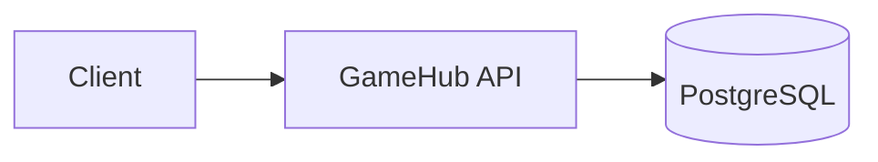

# GameHub

Backend API for a multiplayer game: accounts, matchmaking, ranking and in-game economy.

<!-- TODO (Block C): add badges once CI is running.
[](...)
-->

<!-- TODO (Block C): once deployed, these two links go here, at the very top.
**Live API:** https://... · **API docs (Swagger):** https://.../swagger-ui.html
-->

> **Status:** in development. See the [Roadmap](#roadmap).

---

## Why this project exists

GameHub is a portfolio project with a deliberate design goal: the "game" theme is
an excuse to produce real distributed-systems problems that a typical CRUD
application never creates — matchmaking queues, ranking over large datasets,
idempotent reward delivery and concurrent purchases.

Every feature is judged by one question: *does it create an interesting
engineering problem?* If it doesn't, it stays out of scope.

---

## Scope

**In scope**

- Accounts and authentication (JWT)
- Player profile and statistics
- Matchmaking queue based on MMR
- Match lifecycle and Elo rating calculation
- Global leaderboard
- Inventory, currency and store with idempotent purchases
- Asynchronous event processing
- Production deployment, CI/CD and observability

**Out of scope**

- Game physics, gameplay and rendering — these belong to the client
- Anti-cheat, chat, guilds and tournaments
- A polished front-end: the Swagger UI is the interface

---

## Tech stack

| Layer | Technology |
|---|---|
| Language | Java 21 |
| Framework | Spring Boot 4.1 |
| Database | PostgreSQL 17 |
| Migrations | Flyway |
| Build | Maven |
| Containers | Docker Compose |

<!-- TODO: add rows as they land — Redis, Kafka, Testcontainers, GitHub Actions, AWS, Prometheus, Grafana. -->

---

## Architecture

<!-- TODO (Block B): replace this with a real diagram once Redis, Kafka
     and the extracted worker exist. GitHub renders Mermaid natively. -->



The application is a **modular monolith**: a single deployable unit with
explicit boundaries between domain packages. Services are extracted only when
there is a concrete reason to. See [ADR-002](docs/adr/) for the reasoning.

---

## Getting started

### Prerequisites

- JDK 21
- Docker and Docker Compose

### Running locally

```bash
# 1. Clone the repository
git clone https://github.com/fcardozera/gamehub.git
cd gamehub

# 2. Create your environment and application file from the template
cp .env.example .env
cp src\main\resources\application-template.yaml src\main\resources\application.yaml

# 3. Start the database
docker compose up -d

# 4. Run the application
./mvnw spring-boot:run
```

The API will be available at `http://localhost:8080`.

Database migrations run automatically on startup.

### Stopping

```bash
docker compose down       # stop containers, keep data
docker compose down -v    # stop containers and delete all data
```

---

## Engineering challenges

<!-- TODO: one short section per problem, following the same structure:
     the problem, the alternatives considered, the decision, the trade-off accepted.
     This is the most valuable section of this README — fill it as you solve each one.

     Planned:
     - Duplicate purchases on client retry
     - Negative balance under concurrent purchases
     - Events processed more than once (at-least-once delivery)
     - Matchmaking when no opponent is within range
     - Leaderboard queries without scanning the table
-->

_Coming soon._

---

## Architecture Decision Records

Significant technical decisions are documented in [`docs/adr/`](docs/adr/).

<!-- TODO: link each ADR individually once written.
| ID | Decision |
|---|---|
| ADR-001 | Java 21 and Spring Boot |
| ADR-002 | Modular monolith over microservices |
-->

---

## Roadmap

**v1 — Foundation**

- **[X]** Project skeleton and containerised PostgreSQL
- **[X]** Versioned database schema (Flyway)
- **[X]** Registration
- **[ ]** Login with JWT
- **[ ]** Player profile endpoints
- **[X]** Integration tests with Testcontainers
- **[ ]** OpenAPI documentation

**v2 — Distributed systems**

- **[ ]** Matchmaking queue
- **[ ]** Match results and Elo rating
- **[ ]** Leaderboard
- **[ ]** Event-driven statistics processing
- **[ ]** Idempotent purchases

**v3 — Production**

- **[ ]** Continuous deployment
- **[ ]** Metrics and dashboards
- **[ ]** Load test results

---

## License

Distributed under the MIT License. See [`LICENSE`](LICENSE) for details.